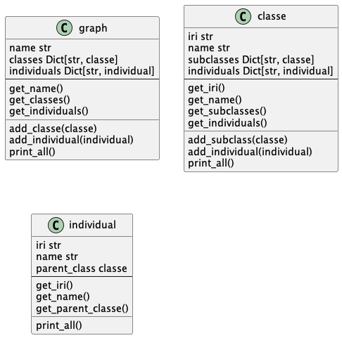

# 1. OwlToPythonClass

- [1. OwlToPythonClass](#1-owltopythonclass)
  - [1.1. Python object](#11-python-object)
  - [1.2. Example](#12-example)
  - [1.3. extractor](#13-extractor)


This package read ontologies and create python object to use them

## 1.1. Python object
Those are the objects  

- graph  
contains the name of the graph, all the classes and all the individuals  
- classe  
contains for a class, his name and iri, all the subclasses and the individuals of the class. 
(the individuals of the subclasses or not in the parent class individuals)
- individual  
contains the name, iri and parent class of the individual
  



## 1.2. Example
the print_all methods show the information of an object  

Here is an example of what we got with the chess ontology

Information of the class `Pieces`
```bash
##### --- CLASSE : Pieces --- #####

##### --- SUBCLASSES --- #####
Chess_Ontology.Bishops : Bishops
Chess_Ontology.Kings : Kings
Chess_Ontology.Knights : Knights
Chess_Ontology.Pawns : Pawns
Chess_Ontology.Queens : Queens
Chess_Ontology.Rooks : Rooks
6 subclasses

##### --- INDIVIDUALS --- #####
0 individuals
```


Information of the class `Rooks`
```bash
##### --- SUBCLASSES --- #####
0 subclasses

##### --- INDIVIDUALS --- #####
Chess_Ontology.R1 : R1
Chess_Ontology.R2 : R2
Chess_Ontology.R3 : R3
Chess_Ontology.R4 : R4
4 individuals
```

Information of the individual `R1`
```bash
##### --- INDIVIDUAL : R1 --- #####

iri : Chess_Ontology.R1
parent_class : Rooks
```

## 1.3. extractor
This `python` file convert an ontology into the previous python objects